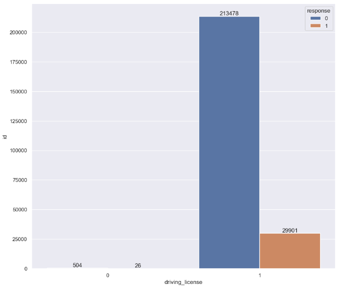
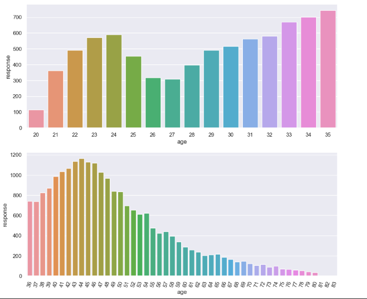
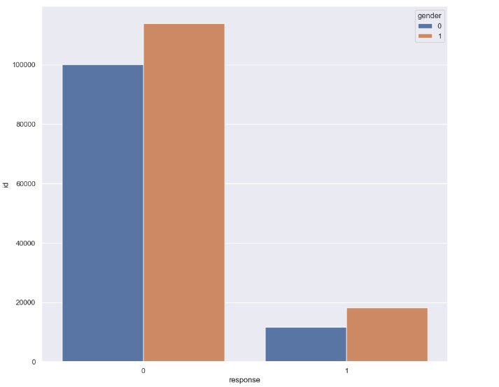
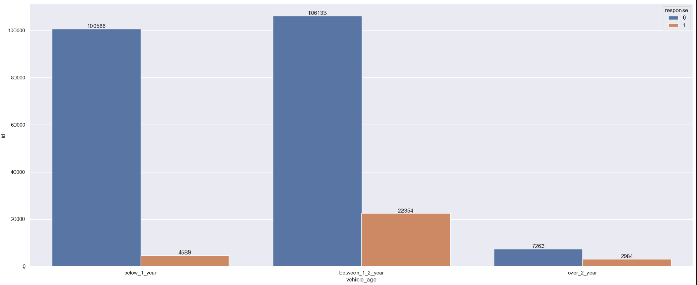
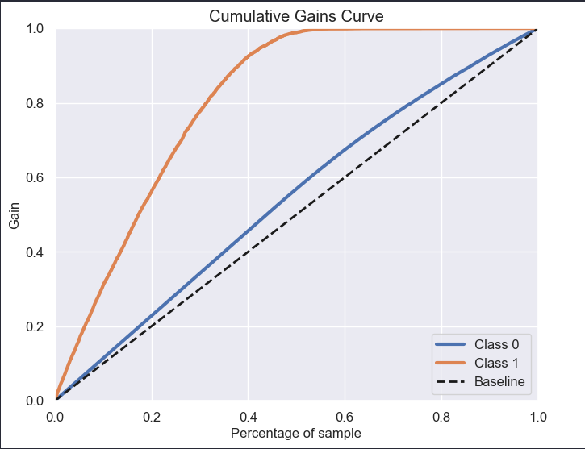
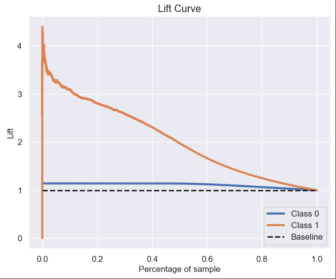
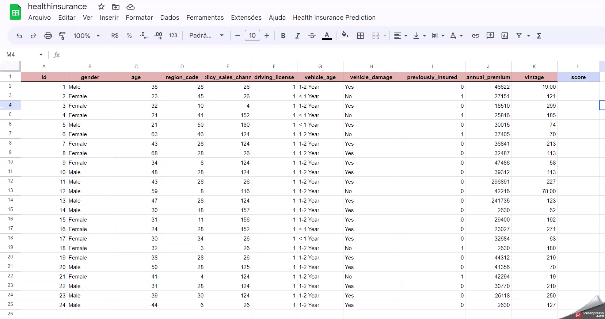

## 1.0. Introdução ao problema de negócio

O contexto apresentado a seguir é completamente fictício, tanto a empresa quanto o problema de negócio foram criados afim de estudos. 

A Cover é uma empresa que oferece seguros de vida para seus clientes e está considerando a possibilidade de lançar um seguro de automóveis. Assim como no seguro de vida, os clientes precisariam pagar uma taxa anual para a Cover em troca de uma cobertura para custos relacionados a acidentes ou danos ao veículo. Para entender melhor o sentimento do cliente, foi realizado uma pesquisa pelo time de produtos para saber se os clientes estavam interessados em comprar ou não o seguro veicular. Passado algum tempo, temos agora diversos novos clientes a qual não participaram da pesquisa e que o time de vendas gostaria de ofertar o seguro veicular. Com o objetivo de otimizar a campanha e limitar as chamadas somente aos clientes mais propensos a comprar o novo produto, fomos acionados como Cientistas de Dados para construir uma solução para que a equipe de vendas possa priorizar os clientes com maior interesse.

### 1.1. Questões do negócio

- Uma lista ordenada com os clientes mais propensos a adquirir o seguro veicular ofertado pela Cover.

## 2.0. Descrição dos dados

| **Feature**             | **Description**                                                                                                                   |
|-------------------------|-----------------------------------------------------------------------------------------------------------------------------------|
|**ID**                   | _Unique ID for the customer_                                                                                                      |
|**Gender**               | _Gender of the customer_                                                                                                          |
|**Age**                  | _Age of the customer_                                                                                                             |
|**Driving_License**      | _Customer does not have DL / Customer already has DL_                                                                             |
|**Region_Code**          | _Unique code for the region of the customer_                                                                                      |
|**Previously_Insured**   | _Customer already has Vehicle Insurance / Customer doesn't have Vehicle Insurance_                                                |
|**Vehicle_Age**          | _Age of the Vehicle_                                                                                                              |
|**Vehicle_Damage**       | _Customer got his vehicle damaged in the past. / Customer didn't get his/her vehicle damaged in the past._                        |
|**Annual_Premium**       | _The amount customer needs to pay as premium in the year_                                                                         |
|**Policy_Sales_Channel** | _Anonymized Code for the channel of outreaching to the customer ie. Different Agents, Over Mail, Over Phone, In Person, etc._     |
|**Vintage**              | _Number of Days, Customer has been associated with the company_                                                                   |
|**Response**             | _Customer is interested / Customer is not interested_                                                                             |

## 3.0. Planejamento da Solução

### 3.1. Entrega Final

- A entrega será feita no Google Sheets, onde será criado um botão integrado ao nosso modelo final, que opere 24/7 e seja capaz de classisficar a lista de clientes de acordo com a maior propensão de ser adquirido o seguro oferecido.

### 3.2. Ferramentas

- [Python 3.8.15](https://www.python.org/downloads/release/python-3815/)
- [Jupyter Notebook](https://jupyter.org/)
- [Scikit Learn](https://scikit-learn.org/0.21/documentation.html) and [XGBoost](https://xgboost.readthedocs.io/en/stable/)
- [Feature importances with Random Forest](https://scikit-learn.org/stable/auto_examples/ensemble/plot_forest_importances.html)
- [Git](https://git-scm.com/) and [Github](https://github.com/)
- [Render](https://render.com/)
- [Google Sheets](https://www.google.com/sheets/about/)
- [Flask](https://flask.palletsprojects.com/en/2.2.x/)

### 3.3. Processo até a solução

Iremos utilizar o método CRISP-DS ao longo do projeto, seguindo todas as suas etapas e visando uma primeira entrega mais
rápida porem mantendo uma boa qualidade, posteriormente poderemos voltar para o inicio do ciclo novamente afim de implementar novas tecnicas e melhorias no projeto caso o resultado final ainda não esteja satisfatório.

- **Business Problem:** Etapa em que é feito um pedido ou pergunta por parte do dono do problema.

- **Business Understand:** Entender mais sobre a motivação por trás da solicitação do problema de negócio.

- **Data Collect:** Fazer a coleta dos dados da Cover através de uma conexão com o Banco de Dados da empresa

- **Data Cleaning:** Realizar o tratamento dos dados faltantes no nosso conjunto de dados, caso haja algum.

- **Data Description:** Entender o quão desafiador é o problema que temos em mãos, conseguiremos responder se temos recursos para trabalhar, quais sãos os tipos de variaveis que temos, qual porcentagem de cada tipo, a quantidade de dados faltantes e a estatistica descritiva dos dados.

- **Feature Engineering:** Derivação de novas features através das originais, que irão nos ajudar na melhoria do modelo de ML, alem de ser parte importante para a validação das hipoteses levantadas e insights para o negócio.

- **EDA:** Entendimento de como as variáveis impactam no fenomeno de propensão de compra, e qual a força desse impacto. Aqui ganhamos experiência do negócio, validaremos as hipoteses levantadas anteriormente e com isso iremos conseguir ter a percepção de quais variáveis são importantes para descrever nosso fenomeno.

- **Data Preparation:** Parte onde os dados são preparados para que possam ser recebidos pelo modelo de ML, dados categóricos e numéricos recebem diferentes tratamentos para que posssam ficar em uma escala numérica próxima.

- **Feature Selection:** Nesta etapa, devemos escolher as features que melhor descrevem o nosso fenomeno, dizemos que estas são as features mais relevantes para o aprendizado do nosso modelo. 

- **Machine Learning Modeling:** Neste projeto, escolhemos os algoritmos Logistic Regression, K-NearestNeighbours, Random Forest, LGBM e XGBoost para serem treinados com nossos dados. 

- **Hyperparameter Fine Tunning:** Utilizado a tecnica de Random Search para escolher os melhores parametros para performance do algoritmo escolhido.

- **Avaliação do modelo:** Utilizado as metricas "Precision/Recall at k" para checar a performance do algoritmo.

- **Resultados financeiros:** Tradução do resultado do modelo para um resultado financeiro, tornando fácil o entendimento dos resultados.

- **Deploy para produção:** Criação de um botão no Google Sheets que seja capaz de percorrer uma lista de clientes e nos informar quais são mais propensos a compra de um novo seguro.

## 4.0. Os 5 principais insights do negócio

- ### **H1:** Clientes que possuem habilitação são mais propensos a comprar um segundo seguro

<h1 align="left">
  
</h1>

- ### **H2:** Clientes com mais de 35 anos são mais propensos a comprar um segundo seguro

<h1 align="left">
  
</h1>

- ### **H3:** Clientes do sexo masculino são mais propensos a comprar um segundo seguro

<h1 align="left">
  
</h1>

- ### **H4:** Clientes que possuem carros entre 1-2 anos são mais propensos a compra de um segundo seguro

<h1 align="left">
  
</h1>

## 5.0. Modelo de Machine Learning

Com nossos dados já tratados e prontos para serem utilizados, escolhemos cinco algoritmos de Classificação nesse primeiro ciclo do CRISP, onde iremos fazer o treinamento de cada um e o modelo que melhor performar será escolhido para ter seus parametros tunados na etapa seguinte.

- [Logistic Regression](https://scikit-learn.org/stable/modules/generated/sklearn.linear_model.LogisticRegression.html)
- [K-NearestNeighbours](https://scikit-learn.org/stable/modules/generated/sklearn.neighbors.KNeighborsClassifier.html)
- [Random Forest Classifier](https://scikit-learn.org/stable/modules/generated/sklearn.ensemble.RandomForestClassifier.html)
- [XGBoost Classifier](https://xgboost.readthedocs.io/en/stable/get_started.html)
- [Light Gradient Boosting Machine](https://lightgbm.readthedocs.io/en/latest/Python-Intro.html#training)

### 5.1. Resultado singular

| MODEL NAME                      | Precision at K   | Recall at K |
|---------------------------------|------------------|-------------|
| Logistic Regression 			  | 0.29  	 		 | 0.64    	   |
| K-NearestNeighbours       	  | 0.29  	 		 | 0.62    	   |
| Random Forest Classifier        | 0.30 	 		 | 0.65    	   |
| XGBoost Classifier       		  | 0.32 	 		 | 0.71    	   |
| Light Gradient Boosting Machine | 0.33     		 | 0.71    	   |

### 5.2. Performance Real - Cross Validation

| MODEL NAME                      | Precision at K      | Recall at K |
|---------------------------------|---------------------|-------------|
| Logistic Regression 			  | 0.292+/-0.0  	 	| 0.745+/-0.0 |
| K-NearestNeighbours       	  | 0.279+/-0.0  	 	| 0.711+/-0.0 |
| Random Forest Classifier        | 0.296+/-0.0 	 	| 0.757+/-0.0 |
| XGBoost Classifier       		  | 0.314+/-0.0	 		| 0.802+/-0.0 |
| Light Gradient Boosting Machine | 0.316+/-0.0   		| 0.806+/-0.0 |

### 5.3. Seleção do modelo

O modelo selecionado para ir para produção foi o LightGBM, os principais motívos pra sua escolha foram:

- Melhor performance
- Treinamento rápido
- Baixo custo computacional

### 5.4. Resultado após ajuste nos hyperparametros do modelo

Aplicado o metodo de **Random Search** para encontrar os melhores hyperparametros para serem usados no treinamento
do XGBoost, o resultado foi o seguinte:

| MODEL NAME        |  Precision at K   | Recall at K   | 
|-------------------|-------------------|---------------|
| LightGBM Classifier | 0.316+/-0.0       |0.8238       |

## 6.0. Bussiness Results

### 6.1 Cumulative Gains Curve

<h1 align="left">
  
</h1>

A Cumulative Gains Curve nos ajuda a entender de maneira mais simplificada o resultado do modelo que temos em mãos, ela nos mostra a proporção dos elementos pertencentes a classe positiva a medida que o numero de clientes contatados aumenta. Essa curva é traçada utilizando a proporção de positivos no eixo vertical e o numero de clientes contatados no eixo horizontal, ao contatar 40% da base de clientes, estamos atingindo 92% dos interessados em adquirir um seguro veicular.

### 6.2 Lift Curve 
<h1 align="left">
  
</h1>

Em termos simples, a lift curve mostra o quanto uma estratégia ou modelo está superando o resultado aleatório (chute). No caso da venda de seguros, a lift curve irá mostrar o quanto a nossa estratégia de segmentação está superando um modelo de previsão aleatório, que não leva em consideração nenhuma informação sobre os clientes.

Na lift curve, o eixo horizontal representa a porcentagem de clientes que foram alvo do modelo. O eixo vertical mostra o quão bem a estratégia ou modelo está funcionando em relação ao modelo aleatório (por exemplo, o número de vezes que a estratégia está superando o modelo aleatório). Podemos ver que nosso modelo é 2x melhor do que um modelo aleatorio se percorrermos 50% da nossa base de clientes.

## 7.0 Conclusão

<h1 align="left">
  
</h1>

## 8.0 Proximos passos

* Criar um pipeline para que faça as etapas de feature engineering, data preparation e model training.

 